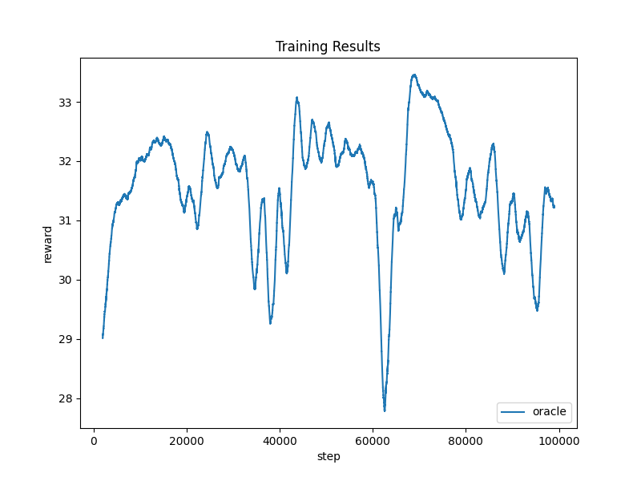
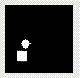

# CLVR Implementation Project - Progress Report

## Reward Induced Representation Learning

Starter Code Repo : <https://github.com/kpertsch/clvr_impl_starter>


## 1. Implement the reward-indcued representation learning model
I contructed the model in [models.py]()

ANd I trained the model using the provided dataset with 6 given rewards.


[train_encoder_all_task.py](https://github.com/jellyho/CLVR_Impl_RIRL/blob/8cd4db4101ef8b9c0694cba546f904e20a1daf6f/train_encoder_all_task.py#L1)

```
python train_encoder_all_task.py
```


#### Loss Graph


## 2. Visualizing the results

### 1) Training Encoders
I trained the model using only 1 reward (horizontal_position, vertical_position) each.

[train_encoder_single_task.py](https://github.com/jellyho/CLVR_Impl_RIRL/blob/8cd4db4101ef8b9c0694cba546f904e20a1daf6f/train_encoder_single_task.py#L1)

```
python train_encoder_single_task.py -r horizontal_position
python train_encoder_single_task.py -r vertical_position
```

#### Loss Graph - Encoder(horizontal_position)


#### Loss Graph - Encoder(vertical_position)


### 2) Training Decoders
Using these pretrained encoder, I trained decoder for each encoder to see what happens.

[train_decoder.py](https://github.com/jellyho/CLVR_Impl_RIRL/blob/8cd4db4101ef8b9c0694cba546f904e20a1daf6f/train_decoder.py#L1)

```
python train_decoder.py -r horizontal_position
python train_decoder.py -r vertical_position
```
#### Loss Graph - Decoder(horizontal_position)


#### Loss Graph - Decoder(vertical_position)


#### Results
The First row is **ground truth** of current state, Second row is decoded image by encoder-decoder only trained using **vertical reward**, and the Thrid row is decoded image by encoder-decoder only trained using **horizontal_reward**.


Circle Shape is the agent. And encoder-decoders are trained on the rewards based on target's position.

As you see, the decoded images contain information about their rewards. For example, see the third row of the image, the white part *contains* information on the horziontal coordinates of the agent, but on the ohter coordinates the information has *faded*.

Therefore, using this model structure, it could be seen that the representation learning containing information about rewards progressed well.

## 3. Implement RL Algorithm

I implemented SAC(Soft Acotr Critic) to compare the performance of image-scratch baseline and pre-trained encoder, and also oracle.

[sac.py]()

I first trained oracle version to see my implementation is correct.

Trianing code is [train_agent.py]()

```
python train_agent.py -t SpritesState-v0 -r . -m oracle
```

The result is shown below.


It seems like working well. 

The reason why agent not following well and keep staying at center more is the environment's time horizon is too short and target is keep moving around randomly. 

So for agent, it is efficient to stay at center to get high reward consistently.

The result of trained agent is shown below.

Testing code is [test_agent.py]()

```
python test_agent.py -t SpritesState-v0 -r . -m oracle
```



## 4. Train SAC with image-scratch baseline and pre-trained encoder.

Encoder for image-scratch version is definded in [model.py]()

I trained three versions (oracle, cnn, encoder) in three environments(number of distracotr 0, 1, 2)

```
python train_agent.py -m encoder -t Sprites-v0 -d ./Results/agents
python train_agent.py -m encoder -t Sprites-v1 -d ./Results/agents
python train_agent.py -m encoder -t Sprites-v2 -d ./Results/agents

python train_agent.py -m cnn -t Sprites-v0 -d ./Results/agents
python train_agent.py -m cnn -t Sprites-v1 -d ./Results/agents
python train_agent.py -m cnn -t Sprites-v2 -d ./Results/agents

python train_agent.py -m oracle -t SpritesState-v0 -d ./Results/agents
python train_agent.py -m oracle -t SpritesState-v1 -d ./Results/agents
python train_agent.py -m oracle -t SpritesState-v2 -d ./Results/agents
```

## 5. Results & Discussion

The results is shown below.