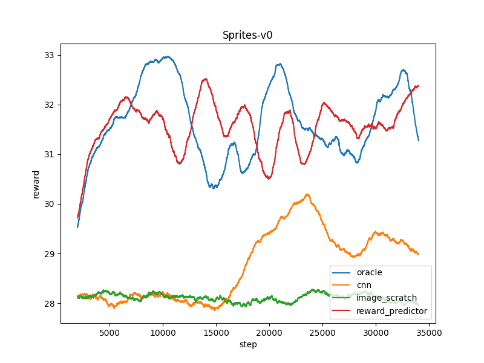

# CLVR Implementation Project - Progress Report

## Reward Induced Representation Learning

Starter Code Repo : <https://github.com/kpertsch/clvr_impl_starter>


**reward horizontal_position and vertical_position are swapped in given code**

## 1. Implement the reward-indcued representation learning model
I contructed the model in [models.py](https://github.com/jellyho/CLVR_Impl_RIRL/blob/7906edb3949ef03c944951e9077b74523887ec1a/models.py#L91)

And I trained the model using the provided dataset with 6 given rewards.


[train_encoder_all_task.py](https://github.com/jellyho/CLVR_Impl_RIRL/blob/8cd4db4101ef8b9c0694cba546f904e20a1daf6f/train_encoder_all_task.py#L1)

```
python train_encoder_all_task.py
```


#### Loss Graph


## 2. Visualizing the results

### 1) Training Encoders
I trained the model using only 1 reward (horizontal_position, vertical_position) each.

[train_encoder_single_task.py](https://github.com/jellyho/CLVR_Impl_RIRL/blob/8cd4db4101ef8b9c0694cba546f904e20a1daf6f/train_encoder_single_task.py#L1)

```
python train_encoder_single_task.py -r horizontal_position
python train_encoder_single_task.py -r vertical_position
```

#### Loss Graph - Encoder(horizontal_position)


#### Loss Graph - Encoder(vertical_position)


### 2) Training Decoders
Using these pretrained encoder, I trained decoder for each encoder to see what happens.

[train_decoder.py](https://github.com/jellyho/CLVR_Impl_RIRL/blob/8cd4db4101ef8b9c0694cba546f904e20a1daf6f/train_decoder.py#L1)

```
python train_decoder.py -r horizontal_position
python train_decoder.py -r vertical_position
```
#### Loss Graph - Decoder(horizontal_position)


#### Loss Graph - Decoder(vertical_position)


#### Results
The First row is **ground truth** of current state, Second row is decoded image by encoder-decoder only trained using **vertical reward**, and the Thrid row is decoded image by encoder-decoder only trained using **horizontal_reward**.
Acutally there are bug in given reward function that vertical reward and horizontal reward flipped. So vertical model learned horizontal reward and horizontal model learned vertical.


Circle Shape is the agent. And encoder-decoders are trained on the rewards based on target's position.

As you see, the decoded images contain information about their rewards. For example, see the third row of the image, the white part *contains* information on the horziontal coordinates of the agent, but on the ohter coordinates the information has *faded*.

Therefore, using this model structure, it could be seen that the representation learning containing information about rewards progressed well.

## 3. Implement RL Algorithm

I implemented SAC(Soft Acotr Critic) to compare the performance of image-scratch, cnn baseline and pre-trained encoder, and also oracle.

[sac.py](https://github.com/jellyho/CLVR_Impl_RIRL/blob/1ee4b380739a913e6b2b7eb7612015ceab1c7dad/sac.py#L215)

I first trained oracle version to see my implementation is correct.

Trianing code is [train_agent.py](https://github.com/jellyho/CLVR_Impl_RIRL/blob/1ee4b380739a913e6b2b7eb7612015ceab1c7dad/train_agent.py#L1)

```
python train_agent.py -m oracle -t SpritesState-v0 -d ./Results/agents
```

The result is shown below.


It seems like working well. But some fluctuation happens, maybe the hyperparameter is not perfect.

The reason why agent not following well and keep staying at center more is the environment's time horizon is too short and target is keep moving around randomly. 

So for agent, it is efficient to stay at center to get high reward consistently.

The result of trained agent is shown below.

Testing code is [test_agent.py](https://github.com/jellyho/CLVR_Impl_RIRL/blob/1ee4b380739a913e6b2b7eb7612015ceab1c7dad/test_agent.py#L1)

```
python test_agent.py -m oracle -t SpritesState-v0 -d ./Results/agents -e 50000
```


## 4. Train SAC with image-scratch baseline and pre-trained encoder.

I tried 4 baselines
- oracle
- cnn
- image_scratch
- reward_predictor(ours)

Encoder for image-scratch version(CNN) is defined in [model.py](https://github.com/jellyho/CLVR_Impl_RIRL/blob/1ee4b380739a913e6b2b7eb7612015ceab1c7dad/models.py#L136)

SAC using cnn and reward_predictor version is defined in [sac.py(oracle)](https://github.com/jellyho/CLVR_Impl_RIRL/blob/d48c97c136e4d668ea3dafc19f02137aa15a5364/sac.py#L227), [sac.py(cnn)](https://github.com/jellyho/CLVR_Impl_RIRL/blob/d48c97c136e4d668ea3dafc19f02137aa15a5364/sac.py#L365), [sac.py(image_scratch)](https://github.com/jellyho/CLVR_Impl_RIRL/blob/d48c97c136e4d668ea3dafc19f02137aa15a5364/sac.py#L378), [sac.py(reward_predictor)](https://github.com/jellyho/CLVR_Impl_RIRL/blob/d48c97c136e4d668ea3dafc19f02137aa15a5364/sac.py#L391)

I trained four versions (oracle, cnn, image_scratch, reward_predictor) in three environments(number of distractor 0, 1, 2)

```
python train_agent.py -m reward_predictor -t Sprites-v0 -d ./Results/agents
python train_agent.py -m reward_predictor -t Sprites-v1 -d ./Results/agents
python train_agent.py -m reward_predictor -t Sprites-v2 -d ./Results/agents

python train_agent.py -m cnn -t Sprites-v0 -d ./Results/agents
python train_agent.py -m cnn -t Sprites-v1 -d ./Results/agents
python train_agent.py -m cnn -t Sprites-v2 -d ./Results/agents

python train_agent.py -m image_scratch -t Sprites-v0 -d ./Results/agents
python train_agent.py -m image_scratch -t Sprites-v1 -d ./Results/agents
python train_agent.py -m image_scratch -t Sprites-v2 -d ./Results/agents


python train_agent.py -m oracle -t SpritesState-v0 -d ./Results/agents
python train_agent.py -m oracle -t SpritesState-v1 -d ./Results/agents
python train_agent.py -m oracle -t SpritesState-v2 -d ./Results/agents
```

## 5. Results & Discussion

You can test the agent by running these codes.
```
python test_agent.py -m oracle -t SpritesState-v0 -d ./Results/agents -e 50000
python test_agent.py -m oracle -t SpritesState-v1 -d ./Results/agents -e 20000
python test_agent.py -m oracle -t SpritesState-v2 -d ./Results/agents -e 40000

python test_agent.py -m cnn -t Sprites-v0 -d ./Results/agents -e 30000
python test_agent.py -m cnn -t Sprites-v1 -d ./Results/agents -e 30000
python test_agent.py -m cnn -t Sprites-v2 -d ./Results/agents -e 35000

python test_agent.py -m image_scratch -t Sprites-v0 -d ./Results/agents -e 35000
python test_agent.py -m image_scratch -t Sprites-v1 -d ./Results/agents -e 35000
python test_agent.py -m image_scratch -t Sprites-v2 -d ./Results/agents -e 35000

python test_agent.py -m reward_predictor -t Sprites-v0 -d ./Results/agents -e 35000
python test_agent.py -m reward_predictor -t Sprites-v1 -d ./Results/agents -e 30000
python test_agent.py -m reward_predictor -t Sprites-v2 -d ./Results/agents -e 25000
```

Gererating Plots
```
python plotter.py
```

Generating GIF Demos
```
python test_agent_gif.py
```

.

The results is shown below.




As you see, oracle and reward_predictior is trained well. But, cnn learned a little. And image_scratch seems like not trained at all.

.


In v1(one distractor) orale and reward_predictor trained well. But we can't see any progress of cnn and image_scratch.

.


In v2(two distractors) Reward_predictor has slightly less performance than oracle.

.

So, we can see that pre-trained encoder helps RL algorithms to learn efficient, high performance(Almost same as oracle).

But, cnn and image_scratch didn't seem to be learning.

Reward Induced Representation Learing helps RL Agent to train efficiently even though there are some distractors. Because encoder's representation have enough information of ground truth state induced by meta tasks.